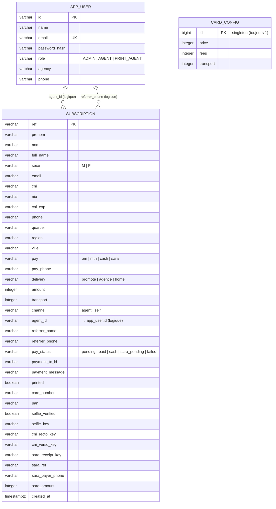

# Schéma de la base de données — portail Promote

Base **PostgreSQL** (`promote`), générée par **JPA/Hibernate** (`spring.jpa.hibernate.ddl-auto: update`).
Aucune migration Flyway/Liquibase : le schéma découle des entités `@Entity` du backend.

- Noms de colonnes : stratégie Spring Boot par défaut (`CamelCaseToUnderscores`) → `payStatus` devient `pay_status`, `fullName` → `full_name`, etc. (aucun `@Column(name=...)` explicite dans le code).
- Types `int`/`boolean` (primitifs Java) → colonnes **NOT NULL** ; `Integer` → nullable.
- 3 tables, **aucune clé étrangère contrainte** au niveau base. Les liens entre `subscription` et `app_user` sont **logiques** (résolus côté application), d'où les traits pointillés dans le diagramme.

> Pour obtenir le DDL **réel** depuis la base en production (source de vérité absolue) :
> ```bash
> docker exec -i promoteapp-db-1 pg_dump -U promote -d promote --schema-only --no-owner
> ```

---

## Diagramme entité-association



---

## DDL PostgreSQL (équivalent généré par Hibernate)

```sql
-- ===================================================================
-- Table : app_user  — comptes du personnel (admin, conseillers, point d'impression)
-- ===================================================================
CREATE TABLE app_user (
    id            varchar(255) NOT NULL,
    name          varchar(255) NOT NULL,
    email         varchar(255) NOT NULL,
    password_hash varchar(255) NOT NULL,
    role          varchar(255) NOT NULL,          -- ADMIN | AGENT | PRINT_AGENT
    agency        varchar(255),                   -- NULL pour l'admin
    phone         varchar(255),                   -- sert à résoudre le parrain (referrer)
    CONSTRAINT pk_app_user PRIMARY KEY (id),
    CONSTRAINT uq_app_user_email UNIQUE (email)
);

-- ===================================================================
-- Table : subscription  — dossiers de souscription Carte Promote
-- ===================================================================
CREATE TABLE subscription (
    ref              varchar(255) NOT NULL,        -- référence métier, ex. PRM-1009
    prenom           varchar(255),
    nom              varchar(255),
    full_name        varchar(255),
    sexe             varchar(255),                 -- M | F
    email            varchar(255),
    cni              varchar(255),                 -- n° pièce d'identité
    niu              varchar(255),                 -- identifiant fiscal (optionnel)
    cni_exp          varchar(255),                 -- expiration, affichée jj/MM/aaaa
    phone            varchar(255),                 -- "+237 6XXXXXXXX"
    quartier         varchar(255),
    region           varchar(255),
    ville            varchar(255),
    pay              varchar(255),                 -- om | mtn | cash | sara
    pay_phone        varchar(255),                 -- n° MoMo (peut différer de phone)
    delivery         varchar(255),                 -- promote | agence | home
    amount           integer      NOT NULL,        -- total réglé / dû
    transport        integer      NOT NULL,        -- part « frais de transport »
    channel          varchar(255),                 -- agent | self
    agent_id         varchar(255),                 -- conseiller propriétaire (→ app_user.id, non contraint)
    referrer_name    varchar(255),                 -- parrain résolu (parcours self)
    referrer_phone   varchar(255),
    pay_status       varchar(255) NOT NULL,        -- pending | paid | cash | sara_pending | failed
    payment_tx_id    varchar(255),                 -- id de transaction agrégateur (TrustPayWay)
    payment_message  varchar(500),                 -- dernier message ; motif d'échec
    printed          boolean      NOT NULL,
    card_number      varchar(255),                 -- n° physique saisi au point d'impression
    pan              varchar(255),                 -- Primary Account Number à l'activation
    selfie_verified  boolean      NOT NULL,
    selfie_key       varchar(255),                 -- clé objet (MinIO/S3) : photo visage
    cni_recto_key    varchar(255),                 -- clé objet : CNI recto
    cni_verso_key    varchar(255),                 -- clé objet : CNI verso
    sara_receipt_key varchar(255),                 -- clé objet : reçu SARA (image/PDF)
    sara_ref         varchar(255),                 -- réf. transaction extraite du reçu (ex. W2026...)
    sara_payer_phone varchar(255),                 -- compte émetteur, "+237 XXXXXXXXX"
    sara_amount      integer,                      -- montant du reçu (XAF)
    created_at       timestamp(6) with time zone NOT NULL,
    CONSTRAINT pk_subscription PRIMARY KEY (ref)
);

-- ===================================================================
-- Table : card_config  — tarification (ligne unique, id = 1)
-- ===================================================================
CREATE TABLE card_config (
    id        bigint  NOT NULL,
    price     integer NOT NULL,
    fees      integer NOT NULL,
    transport integer NOT NULL,
    CONSTRAINT pk_card_config PRIMARY KEY (id)
);

-- ===================================================================
-- Index recommandés (NON créés par Hibernate ici — à ajouter pour la prod)
-- ===================================================================
-- Filtres/tri fréquents de l'admin (historique, KPI) :
CREATE INDEX IF NOT EXISTS ix_subscription_pay_status ON subscription (pay_status);
CREATE INDEX IF NOT EXISTS ix_subscription_created_at ON subscription (created_at);
CREATE INDEX IF NOT EXISTS ix_subscription_agent_id   ON subscription (agent_id);
CREATE INDEX IF NOT EXISTS ix_subscription_pay_tx_id  ON subscription (payment_tx_id);
```

---

## Énumérations (stockées en texte, `@Enumerated(STRING)`)

| Enum | Colonne | Valeurs |
|------|---------|---------|
| `Role` | `app_user.role` | `ADMIN`, `AGENT`, `PRINT_AGENT` |
| `PayStatus` | `subscription.pay_status` | `pending`, `paid`, `cash`, `sara_pending`, `failed` |

## Champs « texte libre » à valeurs contrôlées (non-enum, validés côté appli)

| Colonne | Valeurs attendues |
|---------|-------------------|
| `subscription.pay` | `om`, `mtn`, `cash`, `sara` |
| `subscription.delivery` | `promote`, `agence`, `home` |
| `subscription.channel` | `agent`, `self` |
| `subscription.sexe` | `M`, `F` |

## Notes

- **Pas de FK contraintes** : `agent_id` et `referrer_phone` pointent logiquement vers `app_user` mais ne sont pas déclarés `FOREIGN KEY` (les ventes « self » non attribuées ont `agent_id` nul). On peut les ajouter si l'on veut l'intégrité référentielle stricte.
- **Pas d'`updated_at`** : seul `created_at` est horodaté.
- **Images** : seules les **clés** d'objets sont en base ; les fichiers (selfie, CNI, reçu SARA) vivent dans MinIO/S3.
- **`card_config`** est un singleton (une ligne, `id = 1`).
